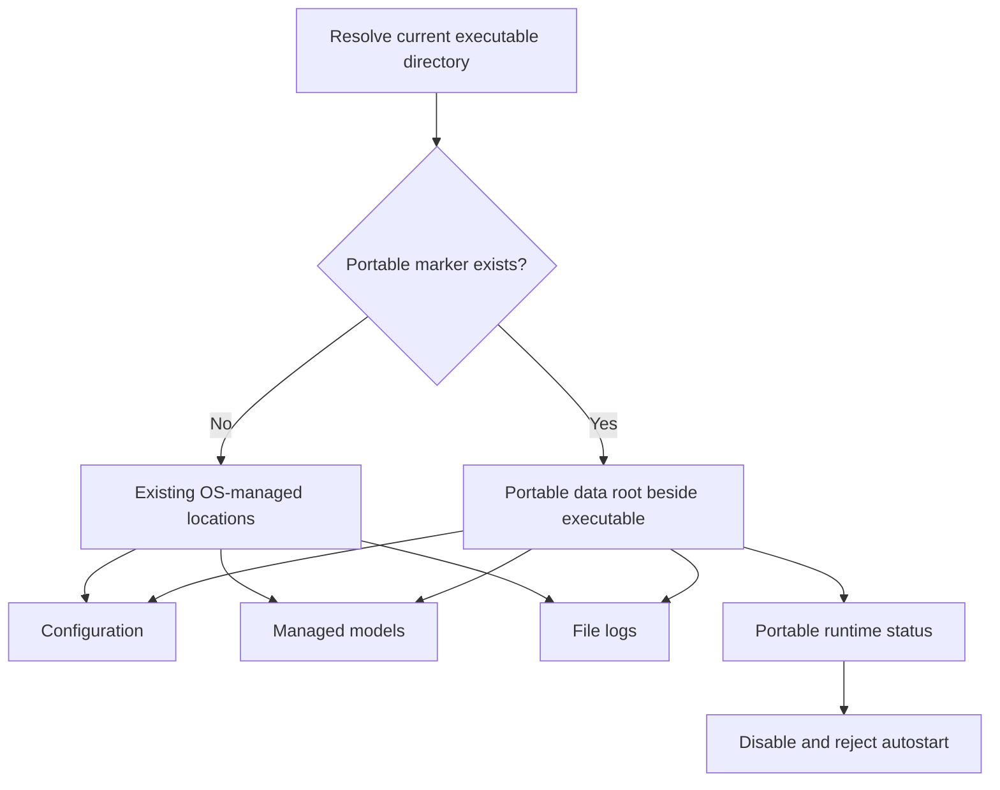
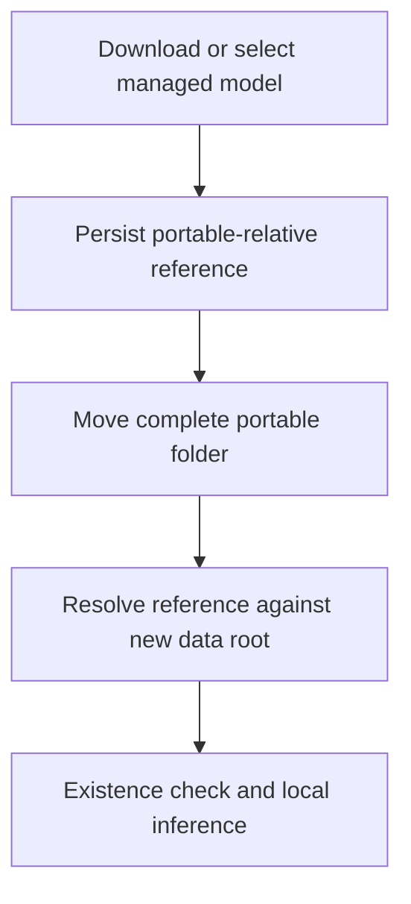
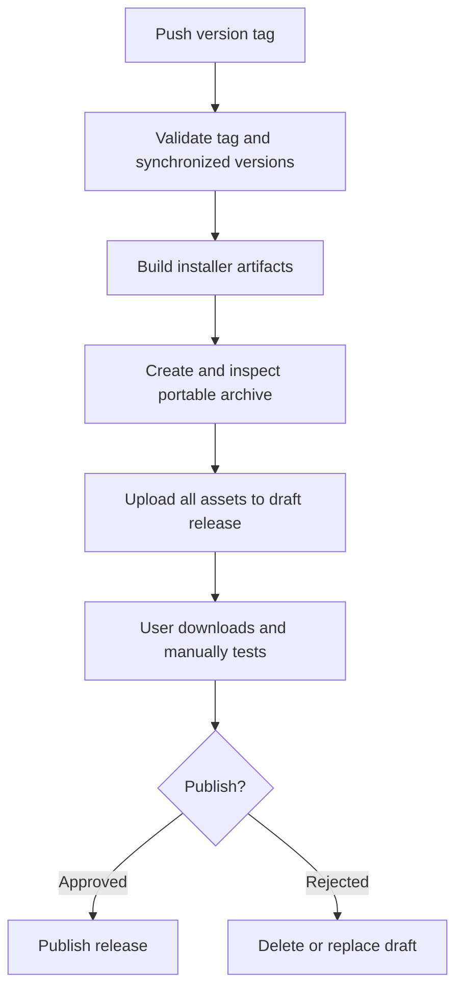

# Portable Release Distribution - Plan

## Goal Capsule

- **Objective:** Add a movable, self-contained Windows edition of VoxWeave and a tag-driven GitHub release process that publishes installer and portable artifacts as draft releases.
- **Product authority:** The approved scope in the planning conversation is authoritative; the Riftle project is the reference for marker-based portability, release packaging, and release documentation.
- **Reference repository:** The local Riftle source is at `D:/develop/projects/riftle`.
- **Execution profile:** Standard cross-cutting change spanning Rust storage paths, runtime policy, settings UI, GitHub Actions, and release documentation.
- **Stop conditions:** Stop if portable execution would silently fall back to AppData, if moving the portable folder breaks the selected local model, or if a workflow test would publish a public release rather than a draft.
- **Tail ownership:** Implementation owns local tests and artifact inspection; the user owns the first real tag push, GitHub Actions run, draft-release inspection, and manual publication decision.

---

## Product Contract

### Summary

VoxWeave will support installed and portable Windows modes from the same executable. A marker beside the executable selects a local `data` directory for settings, downloaded models, and logs, while Git tags create draft installer releases plus a portable ZIP through GitHub Actions.

### Problem Frame

VoxWeave currently resolves settings and downloaded models directly into `%APPDATA%` and sends file logs to Tauri's LocalAppData log directory. Copying the raw executable therefore does not produce a self-contained application, and the saved absolute Whisper model path would break after moving an extracted folder.

The repository also lacks GitHub release automation and release-management documentation. Releases and prereleases need the same repeatable draft-first workflow used by Riftle, adapted to VoxWeave's name, binary, current version line, local-model storage, build requirements, and verification commands.

### Requirements

**Portable runtime**

- R1. The presence of `voxweave.portable` beside `voxweave.exe` selects portable mode; its absence preserves installed behavior.
- R2. Portable mode stores configuration at `data/config.json`, managed Whisper models under `data/models/`, and file logs under `data/logs/` beside the executable.
- R3. Installed mode keeps the current `%APPDATA%/VoxWeave` configuration/model locations and Tauri OS log directory.
- R4. Portable mode never silently falls back to an OS data directory when its local directory cannot be used.
- R5. A selected managed Whisper model remains usable after the complete portable folder is moved to another user-writable location.
- R6. Corrupt-config backup behavior and unknown-field preservation remain unchanged in both modes.

**Runtime policy and UI**

- R7. The backend exposes portable status separately from persisted `AppConfig` so runtime state is not written into `config.json`.
- R8. Launch-at-login cannot be enabled in portable mode, and Settings clearly explains why the control is unavailable.
- R9. Installed-mode launch-at-login behavior remains unchanged.

**Release automation**

- R10. Pushing a `v*` tag runs a Windows GitHub Actions workflow that builds VoxWeave and creates a draft GitHub Release.
- R11. Hyphenated semantic versions are marked as prereleases and build NSIS plus portable ZIP assets without MSI; stable versions retain the normal installer bundle set.
- R12. The workflow fails before publishing assets when the tag and versions in `package.json`, `src-tauri/tauri.conf.json`, and `src-tauri/Cargo.toml` do not agree.
- R13. Each release contains `VoxWeave-<version>-portable-windows-x64.zip` with `voxweave.exe`, `voxweave.portable`, and `README_portable.txt` at the archive root.
- R14. The workflow verifies the portable archive contents before uploading it to the draft release.

**Documentation**

- R15. `.planning/docs/release-strategy.md` is adapted from Riftle at the same repository-relative location and covers test, prerelease, and stable release procedures for VoxWeave.
- R16. The portable README explains storage locations, the writable-folder requirement, launch-at-login behavior including disabling it before converting or moving a copy, WebView2, API-key sensitivity, local logs, models, and marker removal.
- R17. Project documentation describes installed and portable storage accurately, and `CHANGELOG.md` provides the release-note source expected by the release strategy.

### Acceptance Examples

- AE1. Given no marker beside the executable, when VoxWeave starts and saves a setting, then it uses the existing installed-mode directory and does not create a sibling `data` directory.
- AE2. Given the portable marker beside the executable, when VoxWeave starts, saves a setting, writes a log, and downloads a model, then all three artifacts appear only below the sibling `data` directory.
- AE3. Given a portable copy with a selected downloaded model, when the entire folder is moved and VoxWeave starts again, then the model is still selected and local transcription resolves the model in the new folder.
- AE4. Given portable mode, when the user opens General settings, then launch-at-login is disabled with portable-specific help text and a direct backend attempt to enable it is rejected.
- AE5. Given a tag containing a prerelease suffix, when the release workflow succeeds, then the draft release is marked prerelease and contains NSIS and portable assets but no MSI expectation.
- AE6. Given a stable tag, when the release workflow succeeds, then the draft release contains the stable installer bundle assets and the portable ZIP.

### Success Criteria

- Portable runs leave no VoxWeave-owned settings, models, or file logs in AppData.
- Moving the extracted portable directory does not invalidate its managed local-model selection.
- Installed users retain their existing configuration, models, logs, and autostart behavior without migration.
- A workflow-generated portable archive has deterministic naming and contents and remains a draft until manually published.
- The release guide can be followed without consulting the Riftle repository.

### Scope Boundaries

**In scope**

- Windows portable mode, portable-aware owned-data paths, move-safe managed-model references, portable autostart policy, and Settings feedback.
- Windows GitHub Actions releases and prereleases based on Riftle's draft-release workflow.
- Portable archive instructions, the adapted release strategy, changelog bootstrap, and corrections to stale storage documentation.

**Out of scope**

- Migrating an installed user's existing AppData into a portable folder or the reverse.
- Automatically copying API keys, settings, models, or logs between separate VoxWeave installations.
- macOS/Linux release jobs, code signing, update feeds, automatic publication, or publishing the first release during implementation.
- Redacting or changing existing diagnostic log content beyond relocating the file target in portable mode.

---

## Planning Contract

### Key Technical Decisions

- KTD1. Use a marker file adjacent to the running executable, with `data/` as the single portable-owned data root. (session-settled: user-approved — chosen over a separate portable binary: one runtime artifact can serve installer and portable releases while the marker makes the storage policy explicit.)
- KTD2. Include file logs in the portable data boundary. (session-settled: user-approved — chosen over matching Riftle's narrower data list: VoxWeave has a persistent file logger while Riftle does not, so excluding it would still leave VoxWeave-owned data in LocalAppData.)
- KTD3. Keep runtime mode outside `AppConfig`. A dedicated runtime-information command will expose `is_portable` to the frontend without polluting the persisted schema.
- KTD4. Store portable managed-model references relative to the portable data root and resolve them at the Rust boundary before existence checks or inference. Installed-mode absolute paths remain valid, preserving compatibility.
- KTD5. Reject every portable autostart mutation in Rust even though the UI disables the toggle. A portable copy must not add or remove a registry entry that may belong to an installed copy; users disable installed autostart before converting or moving that copy.
- KTD6. Reuse Riftle's tag-triggered, draft-first Tauri Action workflow, adding a version-consistency gate and archive-content validation before upload.
- KTD7. Treat a real GitHub tag run as manual acceptance, owned by the user. Local and static verification must be complete before that run, and the workflow must never auto-publish.

### High-Level Technical Design

The storage decision happens once at process startup and every owned-data consumer uses the resulting policy.

Portable model references cross a persistence/runtime boundary so they remain move-safe.

Release creation remains draft-first and leaves publication to a human decision.

### Sequencing

Implement the portable path contract first because configuration, models, logs, runtime status, UI policy, and release verification all depend on it. Add workflow packaging only after the executable honors the marker, then finish with documentation and end-to-end portable verification.

### Riftle Reference Files

Use the local Riftle repository at `D:/develop/projects/riftle` as the adaptation source:

- `D:/develop/projects/riftle/src-tauri/src/paths.rs` for marker detection and installed/portable data-root selection.
- `D:/develop/projects/riftle/src-tauri/src/lib.rs` and `D:/develop/projects/riftle/src-tauri/src/store.rs` for runtime portable status and autostart policy integration.
- `D:/develop/projects/riftle/src/Settings.vue` for the portable-mode launch-at-startup presentation.
- `D:/develop/projects/riftle/.github/workflows/release.yml` for tag-triggered draft releases, prerelease bundle selection, portable ZIP creation, and asset upload.
- `D:/develop/projects/riftle/.github/release/README_portable.txt` for the user-facing portable archive instructions.
- `D:/develop/projects/riftle/.planning/docs/release-strategy.md` for the release strategy that must be copied to the same relative location in VoxWeave and fully adapted.

These are machine-local source references requested for implementation. All new or modified VoxWeave paths remain repository-relative elsewhere in this plan.

---

## Implementation Units

### U1. Introduce the portable-aware storage contract

- **Goal:** Centralize installed/portable path selection and route configuration, models, logs, and runtime model resolution through it.
- **Requirements:** R1-R6; AE1-AE3; KTD1, KTD2, KTD4.
- **Dependencies:** None.
- **Files:** Create `src-tauri/src/paths.rs`; modify `src-tauri/src/lib.rs`, `src-tauri/src/state.rs`, `src-tauri/src/config/persistence.rs`, `src-tauri/src/transcription/download.rs`, `src-tauri/src/commands/download.rs`, `src-tauri/src/transcription/service.rs`, and `src-tauri/src/hotkey/service.rs`; add inline Rust tests in the feature-bearing modules.
- **Approach:** Model the running mode as a portable-aware storage policy derived from the executable directory. Keep pure helpers that accept an executable directory for deterministic temporary-directory tests. Configuration and models share the policy's data root. Logging uses a folder target only in portable mode and retains `TargetKind::LogDir` in installed mode. Portable storage-initialization failures propagate through application setup instead of being converted into in-memory defaults; malformed-config recovery remains unchanged. Portable managed-model references are persisted relative to the data root and resolved before download comparison, deletion, availability checks, provider construction, and inference; installed absolute paths continue to work.
- **Execution note:** Add path and model-reference characterization tests before replacing the current hardcoded directory helpers.
- **Patterns to follow:** Riftle's pure executable-directory helper and marker detection; VoxWeave's existing config unknown-field merge and corrupt-file backup behavior; current `VALID_MODEL_IDS` validation.
- **Test scenarios:**
  1. Covers AE1. With a temporary executable directory and no marker, resolving mode returns installed and preserves the existing config/model/log policy.
  2. Covers AE2. With `voxweave.portable` present, resolving mode returns portable and derives `data`, `data/config.json`, `data/models`, and `data/logs` below the executable directory.
  3. With a portable marker but an unusable local data root, path creation returns an error and never substitutes an AppData path.
  4. Existing config load/save tests pass through an injectable data root while retaining unknown keys and corrupt-file backup behavior.
  5. In installed mode, an existing absolute model path resolves unchanged.
  6. Covers AE3. In portable mode, a stored relative model reference resolves below the current data root; changing the simulated executable directory changes the resolved absolute path without changing persisted config.
  7. Download completion, selection, deletion, missing-model checks, and provider creation agree on the same resolved model path in both modes.
  8. Invalid model IDs and path traversal attempts cannot escape the managed models directory.
- **Verification:** Rust tests prove both path modes, move-safe model resolution, preservation behavior, and fail-closed path handling; code search confirms no independent `%APPDATA%/VoxWeave` derivation remains in config or model modules.

### U2. Enforce portable runtime policy in Settings and autostart

- **Goal:** Expose portable status to the UI and make launch-at-login unavailable in portable mode at both frontend and backend boundaries.
- **Requirements:** R7-R9; AE4; KTD3, KTD5.
- **Dependencies:** U1.
- **Files:** Modify `src-tauri/src/commands/config.rs`, `src-tauri/src/lib.rs`, `src/types/index.ts`, `src/composables/useConfig.ts`, and `src/windows/settings/components/GeneralSection.vue`; add Rust tests in `src-tauri/src/commands/config.rs`.
- **Approach:** Add a serializable runtime-info response containing portable status and load it alongside configuration in the shared composable. Keep the launch-at-login row visible for discoverability, but disable its checkbox, associate the portable explanation accessibly with the control, and render it unchecked regardless of a stale installed-mode value. Structure the Rust command so its portable guard is unit-testable independently of the registry plugin. For installed mode, update the UI flow to change the OS registration before persisting the matching config value and retain the prior UI/config value when registration fails. Do not persist `is_portable` or rewrite `launch_at_login` merely because a copy is running portably.
- **Patterns to follow:** Existing thin Tauri commands and TypeScript interfaces that mirror serialized Rust payloads; Riftle's disabled portable autostart presentation.
- **Test scenarios:**
  1. Installed runtime info serializes `is_portable: false`; portable runtime info serializes `is_portable: true`.
  2. Covers AE4. A portable backend request to enable launch-at-login returns an error before calling the autostart manager.
  3. A portable backend request to disable launch-at-login is also rejected so it cannot remove an installed copy's startup entry.
  4. Installed enable/disable requests continue to delegate to the existing plugin behavior.
  5. Settings type-checks with runtime info loaded and renders the launch-at-login input disabled in portable mode with explanatory copy.
  6. The disabled control remains keyboard/screen-reader understandable through native disabled semantics and associated explanatory text.
  7. Runtime-info load failure leaves Settings usable and does not accidentally enable portable autostart; surface the error through the composable's existing error channel.
  8. An installed-mode autostart plugin failure leaves both persisted config and the checkbox at their previous value.
- **Verification:** Rust command-policy tests pass, `npx vue-tsc --noEmit` passes, and a local portable smoke run confirms the disabled control and backend rejection.

### U3. Add draft release and portable archive automation

- **Goal:** Adapt Riftle's `.github` release assets so VoxWeave tags produce validated draft installer and portable artifacts.
- **Requirements:** R10-R14; AE5, AE6; KTD6, KTD7.
- **Dependencies:** U1 and U2.
- **Files:** Create `.github/workflows/release.yml` and `.github/release/README_portable.txt`.
- **Approach:** Use Windows latest, Node LTS, Rust stable, pnpm 9, frozen dependencies, and `tauri-apps/tauri-action`. Validate the pushed tag against synchronized versions before building. Select NSIS-only bundles for hyphenated prereleases and the configured stable bundle set otherwise. After the Tauri Action creates the draft, stage the raw release executable with the marker and adapted README, compress it with the required name, expand or list the archive to assert exact required root entries, and upload it to the same draft using the workflow token.
- **Execution note:** Treat this as packaging/config work: prove it first through deterministic validation and artifact inspection; reserve the live GitHub tag run for user acceptance.
- **Patterns to follow:** Riftle's `.github/workflows/release.yml` and `.github/release/README_portable.txt`, adapted to `VoxWeave`, `voxweave.exe`, `voxweave.portable`, current project paths, and current storage contents.
- **Test scenarios:**
  1. A stable tag equal to all three project versions selects the normal stable bundle configuration and produces the expected portable ZIP name.
  2. Covers AE5. A `-beta.1` or `-test.1` tag selects NSIS-only bundling and sets GitHub prerelease metadata.
  3. A tag/version mismatch or disagreement among the three version files fails before the Tauri release step.
  4. A missing release executable, portable README, or marker causes archive creation/validation to fail.
  5. The verified ZIP contains exactly the executable, marker, and portable README at its root, with no build-directory nesting.
  6. The workflow requests only `contents: write`, uses the automatic repository token, creates a draft, and never invokes automatic publication.
- **Verification:** Review the workflow syntax and evaluated PowerShell paths locally where possible; inspect a locally assembled ZIP; the user later runs the documented test tag and verifies the draft release in GitHub.

### U4. Adapt release and storage documentation

- **Goal:** Make portable operation and the release process understandable without referring back to Riftle.
- **Requirements:** R15-R17; KTD7.
- **Dependencies:** U1-U3.
- **Files:** Create `.planning/docs/release-strategy.md` and `CHANGELOG.md`; modify `README.md`, `.planning/PROJECT.md`, `.planning/REQUIREMENTS.md`, `.planning/ROADMAP.md`, `AGENTS.md`, and `CLAUDE.md` where their storage/release statements are stale.
- **Approach:** Copy Riftle's release strategy structure at the same relative location and rewrite every product name, binary name, marker, archive name, repository path, version example, asset expectation, data list, and verification command for VoxWeave. Use `v0.0.0-test.1` for an unpublished workflow test, `v0.1.0-beta.1` for the first prerelease example, and `v0.1.0` for the first stable example unless the actual release target changes before execution. Bootstrap `CHANGELOG.md` with an unreleased section and explain how release sections supply GitHub release notes. Update prior fixed-AppData statements to describe installed defaults plus the portable override without rewriting unrelated historical decisions.
- **Patterns to follow:** Riftle's `.planning/docs/release-strategy.md`; VoxWeave's current README voice and planning-document terminology.
- **Test scenarios:**
  1. Search documentation for stale unconditional claims that configuration or models always live under `%APPDATA%/VoxWeave`; each occurrence is corrected or explicitly historical.
  2. Search adapted files for `Riftle`, `riftle.exe`, `riftle-launcher.portable`, Riftle archive names, and Riftle repository paths; no accidental reference remains.
  3. The portable README states that API keys and logs are local sensitive data, models can be large, the folder must be writable, WebView2 is required, launch-at-login is unavailable, and installed autostart should be disabled before converting or moving a copy.
  4. The release strategy's test procedure creates a draft prerelease, expects no MSI for a hyphenated version, verifies the portable data layout, and includes cleanup of the temporary tag, branch, and draft.
  5. The stable procedure expects installer assets plus the portable ZIP and requires manual publication only after verification.
- **Verification:** Documentation links and commands are internally consistent with the workflow and runtime names; repository-wide searches find no unintended Riftle branding or obsolete unconditional storage descriptions.

### U5. Perform local portable acceptance verification

- **Goal:** Verify the built executable's portable boundary and archive behavior before the user tests live release creation.
- **Requirements:** R1-R9, R13-R14; AE1-AE4; KTD7.
- **Dependencies:** U1-U4.
- **Files:** No product files required; record the repeatable checklist in `.planning/docs/release-strategy.md` and `.github/release/README_portable.txt`.
- **Approach:** Build the release executable, create an isolated portable folder matching the archive layout, and test it from a user-writable location. Snapshot the relevant installed-mode AppData directories before the run, exercise settings, logging, model selection/download where practical, restart, move the complete folder, and compare the resulting filesystem state. Separately launch a no-marker copy to confirm installed behavior remains unchanged.
- **Execution note:** This is a runtime smoke gate. Do not simulate success solely with unit tests because Tauri log targeting, WebView2 startup, and filesystem behavior cross process boundaries.
- **Test scenarios:**
  1. Extract the portable layout to a clean writable folder; first launch creates `data/config.json` and `data/logs` beside the executable.
  2. Change settings, exit, relaunch, and confirm the changes persist locally.
  3. Select or download a small managed model, exit, move the complete folder, relaunch, and confirm the model remains selected and resolvable from the new `data/models` path.
  4. Confirm no new or modified VoxWeave config, model, or file-log artifacts appeared in the installed AppData locations during the portable run.
  5. Confirm General settings disables launch-at-login and a direct portable backend enable request fails without creating a Windows startup entry.
  6. Remove the marker from a disposable copy, launch it, and confirm it uses installed-mode storage rather than the sibling `data` folder.
  7. Inspect the ZIP root and run directly from its extracted contents without adding files manually.
- **Verification:** Capture pass/fail results for each scenario before handing the workflow to the user for the live test-tag run.

---

## Verification Contract

| Gate | Applies to | Verification | Done signal |
|---|---|---|---|
| Rust behavior | U1, U2 | `cargo test` | Portable/installed path, model-reference, config-preservation, and autostart-policy tests pass. |
| Rust quality | U1, U2 | `cargo clippy -- -D warnings` | No warnings or portability-specific lint regressions. |
| Frontend types | U2 | `npx vue-tsc --noEmit` | Runtime-info and disabled-state UI compile cleanly. |
| Frontend lint | U2 | `npm run lint` when available | UI changes pass the repository lint gate; if the script remains absent, document that existing repository limitation rather than inventing a substitute. |
| Production build | U1-U3 | `cargo tauri build` | Windows release executable and configured installer artifacts build successfully. |
| Documentation audit | U4 | Repository-wide targeted searches | No unintended Riftle branding or stale unconditional AppData claims remain. |
| Portable runtime smoke | U5 | Execute the scenarios in U5 | Local persistence, logs, model relocation, AppData isolation, marker switching, and autostart policy all pass. |
| Workflow acceptance | U3-U5 | User pushes the documented test tag | GitHub creates the expected unpublished draft prerelease with valid installer and portable assets. |

The workflow acceptance gate is intentionally manual and user-owned. Implementation is complete enough to hand over when every earlier gate passes and the exact test-tag procedure is documented; public release publication is not part of this plan.

---

## Risks and Dependencies

- **Absolute model-path leakage:** Any remaining consumer that reads `model_path` directly can make a moved portable folder fail. Mitigate with one resolver and repository-wide call-site auditing.
- **Write permissions:** Portable storage beside the executable requires extraction to a user-writable directory. Document this and fail without falling back to AppData.
- **Sensitive local data:** Portable `config.json` contains provider API keys, and file logs may contain diagnostic content including transcription output under current logging behavior. Warn users that the entire folder is sensitive.
- **Large models:** Portable folders may contain models up to roughly 1.5 GB; the release ZIP does not bundle models, but user-downloaded models travel with the folder.
- **Native build environment:** `whisper-rs` requires the Windows C/C++ toolchain and CMake. The GitHub runner must satisfy the same production-build prerequisites as local builds.
- **MSI prerelease limitation:** Semantic prerelease labels are not valid MSI product versions, so prerelease jobs must remain NSIS-only.
- **Workflow side effects:** A pushed test tag creates GitHub state. The strategy must keep releases draft-only and include explicit cleanup.

---

## Definition of Done

- U1 is complete when all owned-data consumers share the portable-aware policy, installed behavior is preserved, relative managed-model references survive moves, and tests cover failure boundaries.
- U2 is complete when portable status reaches Settings, launch-at-login is disabled visibly, backend enforcement is tested, and installed behavior remains intact.
- U3 is complete when the adapted workflow validates versions, creates draft stable/prerelease assets, verifies the portable archive, and contains no Riftle-specific values.
- U4 is complete when the adapted release strategy exists at `.planning/docs/release-strategy.md`, portable instructions and changelog are present, and storage/release documentation agrees with implementation.
- U5 is complete when the local portable smoke checklist passes and the documented live test-tag procedure is ready for the user.
- All Verification Contract gates except the explicitly user-owned live workflow acceptance have passed.
- No abandoned experimental path resolver, duplicate directory logic, temporary release artifact, or dead workflow branch remains in the final diff.
