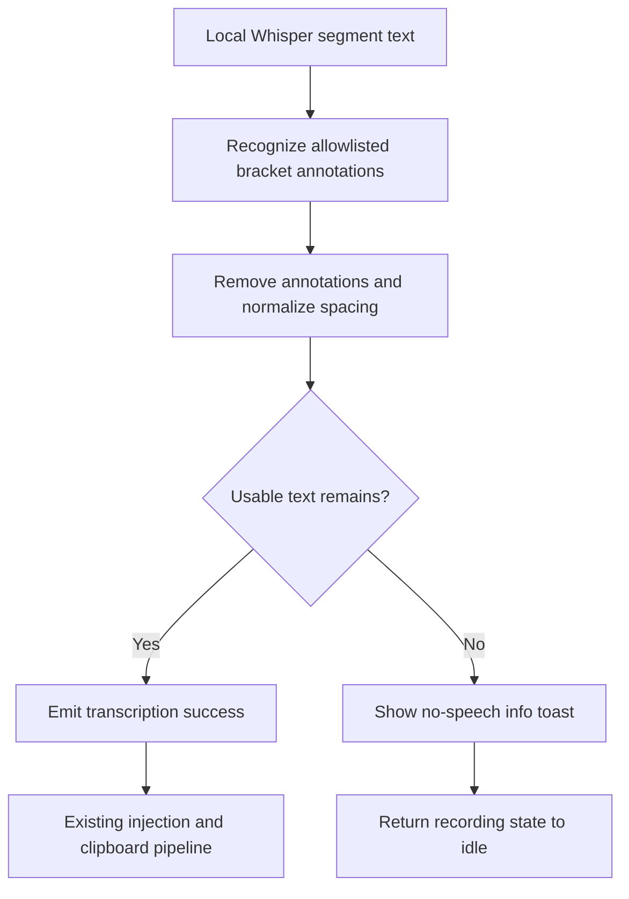

# Local Silence Annotation Suppression - Plan

## Goal Capsule

- **Objective:** Prevent local Whisper models from injecting non-speech annotations while preserving usable speech around pauses.
- **Product authority:** B001 in `docs/TODO.md` and the behavior settled in the planning conversation are authoritative.
- **Execution profile:** Standard localized change across local transcript normalization and transcription completion orchestration.
- **Stop conditions:** Stop if the implementation would suppress arbitrary bracketed content, alter cloud-provider transcripts, or require an audio activity threshold that can reject quiet speech.
- **Tail ownership:** Implementation owns automated checks and local code quality; runtime acceptance requires a downloaded local model and microphone input.

---

## Product Contract

### Summary

Local Whisper output will remove a defined set of non-speech annotations before injection. Mixed transcripts retain their spoken content, while a recording that contains no remaining text produces an informational no-speech toast and no clipboard or injection side effect.

### Problem Frame

The local provider currently concatenates every decoded Whisper segment and returns it as successful text. Whisper can represent silence as annotations such as `[BLANK_AUDIO]` or `[Pause]`, so the shared pipeline treats those labels as dictated content and injects them into the target application.

The fix must distinguish generated non-speech annotations from arbitrary bracketed content. It must also terminate cleanly when annotation removal leaves no usable text, without reclassifying silence as a retryable provider failure.

### Requirements

**Local transcript cleanup**

- R1. Cleanup applies only to transcripts produced by the local provider; OpenAI and Groq responses remain unchanged.
- R2. Cleanup removes complete square-bracket annotations whose normalized labels are blank audio, pause, silence, no speech, music, applause, laughter, noise, or inaudible.
- R3. Annotation matching is case-insensitive and treats spaces, underscores, and hyphens as equivalent separators.
- R4. Arbitrary bracketed content such as `[TODO]`, `[1]`, and `[important]`, plus malformed or unclosed brackets, remains unchanged.
- R5. Each removed annotation becomes a word boundary; surrounding whitespace is collapsed, edges are trimmed, and all remaining text and punctuation are preserved.

**Completion behavior**

- R6. When cleanup leaves usable text, the existing injection and clipboard behavior receives the cleaned text.
- R7. When cleanup leaves no text, VoxWeave injects and copies nothing, returns to idle, and shows the existing transient info toast with the message `No speech detected.`
- R8. A no-speech outcome exposes no retry or cloud-fallback action.

**Scope**

- R9. This fix does not add whole-recording audio gating or attempt to suppress free-form hallucinated words from silent audio.
- R10. This fix does not add configurable annotation labels or new toast-duration behavior.

### Acceptance Examples

- AE1. Given local output `[BLANK_AUDIO]`, when cleanup completes, then no text is injected or copied and the no-speech info toast appears without an action.
- AE2. Given local output `Hello[Pause]world`, when cleanup completes, then `Hello world` follows the existing injection and clipboard pipeline.
- AE3. Given local output `[Pause][Pause][Pause]`, when cleanup completes, then it is treated as a no-speech outcome once rather than injecting labels or offering a retry.
- AE4. Given local output `Add [TODO] after [Noise]`, when cleanup completes, then the result is `Add [TODO] after`, preserving the arbitrary bracketed span.
- AE5. Given an empty cloud-provider response, when transcription completes, then this local-only fix does not change the cloud path's current behavior.

### Success Criteria

- The reported `[BLANK_AUDIO]` and repeated `[Pause]` cases never reach injection or clipboard handling.
- Usable speech on either side of a removed annotation is preserved with readable spacing.
- A marker-only local transcript follows the no-speech terminal state and returns the recording state to idle.
- Cloud transcription behavior and normal local transcription remain unchanged.

### Scope Boundaries

**In scope**

- Deterministic post-processing of local Whisper text.
- Provider-aware handling of an empty cleaned local result.
- Automated coverage for annotation matching, preservation, spacing, and provider scoping.
- Runtime smoke verification of mixed-speech and fully silent local recordings.

**Out of scope**

- RMS/VAD-based whole-recording speech classification.
- General Whisper hallucination detection.
- Cloud transcript normalization.
- User-configurable annotation dictionaries.

---

## Planning Contract

### Key Technical Decisions

- KTD1. Normalize the collected local transcript after Whisper segment decoding and before it leaves the local provider. (session-settled: user-approved — chosen over shared provider normalization: B001 is local-specific and cloud responses must remain unchanged.)
- KTD2. Use an explicit normalized-label allowlist rather than deleting every square-bracket span. (session-settled: user-directed — chosen over deleting all bracketed content: dictated or meaningful values such as `[TODO]` and `[1]` must survive.)
- KTD3. Replace removed annotations with a separator and normalize resulting whitespace. (session-settled: user-approved — chosen over literal deletion: adjacent words must not become concatenated.)
- KTD4. Classify a cleaned empty local result before emitting transcription success or entering injection, and reuse that completion decision in both normal and provider-override transcription paths.
- KTD5. Deliver no-speech feedback through the existing plain info-toast path and return the transcription attempt as handled-without-text. Do not add a retryable error code or frontend action because R7-R8 define a terminal non-error outcome.
- KTD6. Do not rely on Whisper decoder thresholds for the product contract. In whisper-rs 0.16, `suppress_blank` already defaults to true, `suppress_nst` operates on decoder tokens, and the no-speech threshold is not a reliable application-level guarantee for removing emitted annotations.

### High-Level Technical Design

### Sequencing

Build and test the pure local transcript cleanup first. Then route cleaned empty results through one provider-aware completion decision before success events or injection, and finish by exercising the runtime behavior with a real local model.

### Sources and Research

- `docs/TODO.md` defines B001 and the observed `[BLANK_AUDIO]` and `[Pause]` outputs.
- `src-tauri/src/transcription/local.rs` is the local-only segment collection boundary and already hosts pure WAV helpers with inline tests.
- `src-tauri/src/transcription/service.rs` owns transcription success events, provider identity, toast delivery, and both normal and provider-override completion paths.
- `src-tauri/src/hotkey/service.rs` enters injection only after `transcribe_with_retry` returns text and already resets failed or handled-without-text attempts to idle.
- [whisper-rs 0.16 `FullParams` documentation](https://docs.rs/whisper-rs/0.16.0/whisper_rs/struct.FullParams.html) documents the available decoder controls and their defaults.
- [whisper-rs 0.16 parameter source](https://docs.rs/whisper-rs/0.16.0/src/whisper_rs/whisper_params.rs.html) shows that blank suppression defaults to enabled and distinguishes it from non-speech-token suppression and the no-speech threshold.

---

## Implementation Units

### U1. Normalize local Whisper annotations

- **Goal:** Remove allowlisted non-speech annotations from local transcripts without damaging surrounding speech or arbitrary bracketed content.
- **Requirements:** R1-R6, R9-R10; AE2-AE4; KTD1-KTD3, KTD6.
- **Dependencies:** None.
- **Files:** Modify `src-tauri/src/transcription/local.rs`; add inline Rust tests in `src-tauri/src/transcription/local.rs`.
- **Approach:**
  1. Introduce a pure transcript-normalization helper beside the existing WAV helper so it remains testable without loading a native model.
  2. Parse complete square-bracket spans, normalize candidate labels for case and separator differences, and remove only allowlisted labels.
  3. Treat each removed annotation as a separator, normalize whitespace, and preserve unmatched spans, malformed brackets, Unicode text, and punctuation.
  4. Apply the helper once after collecting all local Whisper segments and before returning provider text.
- **Execution note:** Start with focused failing tests for the reported markers, mixed speech, and bracket-preservation boundary.
- **Patterns to follow:** Pure helper plus inline `#[cfg(test)]` coverage in `src-tauri/src/transcription/local.rs`; provider-specific transformation stays inside the provider implementation.
- **Test scenarios:**
  1. Covers AE1. `[BLANK_AUDIO]` and case/separator variants normalize to an empty string.
  2. Covers AE3. Adjacent and whitespace-separated repeated pause annotations normalize to an empty string.
  3. Covers AE2. `Hello[Pause]world` normalizes to `Hello world`.
  4. Every R2 allowlisted label is removed case-insensitively, including space, underscore, and hyphen separator variants.
  5. Covers AE4. `[TODO]`, `[1]`, and `[important]` remain unchanged while an allowlisted annotation in the same transcript is removed.
  6. Unclosed or malformed brackets remain unchanged and do not cause later text to be discarded.
  7. Leading, trailing, and repeated whitespace introduced around removed annotations collapses without altering remaining punctuation or Unicode text.
  8. A transcript with no annotations retains its text apart from the agreed whitespace normalization.
- **Verification:** Focused local-provider tests prove the allowlist, preservation boundary, repeated-marker handling, and mixed-speech output without requiring a model file.

### U2. Terminate cleaned no-speech results before injection

- **Goal:** Convert an empty cleaned local transcript into the agreed info-toast terminal state while preserving all non-empty and cloud completion paths.
- **Requirements:** R1, R6-R10; AE1, AE3, AE5; KTD4-KTD5.
- **Dependencies:** U1.
- **Files:** Modify `src-tauri/src/transcription/service.rs` and `docs/TODO.md`; add inline Rust tests in `src-tauri/src/transcription/service.rs`.
- **Approach:**
  1. Centralize provider-aware successful-result classification so both normal transcription and provider-override transcription use the same decision.
  2. For local cleaned text that is empty after trimming, do not emit the transcription-done event or return text to the injection caller.
  3. Show `No speech detected.` through the existing plain info-toast payload with no action, then let the existing handled-without-text path restore idle state.
  4. Preserve current success emission and return behavior for non-empty local text and all cloud-provider results.
  5. Mark B001 complete in `docs/TODO.md` only after automated and runtime acceptance checks pass, preserving unrelated edits already present in that file.
- **Execution note:** Keep classification pure enough to unit-test provider and text combinations; use runtime smoke verification for the Tauri window side effect.
- **Patterns to follow:** Existing centralized success handling in `src-tauri/src/transcription/service.rs`; existing plain info-toast payloads and the hotkey error/handled path's idle reset.
- **Test scenarios:**
  1. A local empty or whitespace-only cleaned result classifies as no speech.
  2. A non-empty cleaned local result remains deliverable with its text unchanged.
  3. Covers AE5. Empty OpenAI and Groq results do not enter the new local no-speech branch.
  4. Both normal and provider-override completion paths use the same provider-aware classification.
  5. A no-speech result is non-retryable, has no fallback provider, and does not emit a transcription-done success before returning.
  6. Existing retryable provider errors, model errors, cancellation, and successful transcription tests retain their behavior.
- **Verification:** Rust tests prove provider scoping and terminal-state classification; a local-model smoke test confirms no injection or clipboard mutation, the info toast, and the final idle state.

---

## Verification Contract

| Gate | Applies to | Verification | Done signal |
|---|---|---|---|
| Focused Rust behavior | U1, U2 | `cargo test transcription::local` and focused transcription-service tests from `src-tauri/` | Annotation cleanup and provider-aware no-speech classification pass. |
| Full Rust regression | U1, U2 | `cargo test` from `src-tauri/` | Existing transcription, audio, injection, and configuration tests remain green. |
| Rust quality | U1, U2 | `cargo clippy -- -D warnings` from `src-tauri/` | No warnings or new lint regressions. |
| Frontend contract | U2 | `npx vue-tsc --noEmit` | Existing toast payload consumption and Tauri command contracts still type-check. |
| Production integration | U1, U2 | `cargo tauri build` | The native whisper-rs application and Windows bundle build successfully. |
| Runtime acceptance | U1, U2 | Exercise AE1-AE4 with a downloaded local model | Silent and marker-only recordings show the info toast with no injection/copy; mixed speech injects cleaned text; arbitrary brackets survive. |

---

## Risks and Dependencies

- **Allowlist drift:** Local models may emit new or localized annotations. Keep the label set centralized and table-tested so future additions are narrow and reviewable.
- **Over-suppression:** A user could intentionally dictate an allowlisted bracket label. The explicit allowlist limits this tradeoff and preserves every other bracketed value.
- **Whitespace damage:** Naive substring deletion can concatenate words or disturb punctuation. Tests must cover markers without surrounding spaces, repeated markers, and Unicode text.
- **Completion-path divergence:** Normal and provider-override transcription currently finalize success separately. One shared classification decision prevents no-speech behavior from differing between entry points.
- **Native runtime dependency:** Unit tests can prove normalization without a model, but the toast and absence of injection require a local-model smoke test on Windows.

---

## Definition of Done

- U1 is complete when every agreed annotation variant is removed locally, arbitrary bracketed content is preserved, and mixed speech remains readable.
- U2 is complete when cleaned empty local results bypass success emission, injection, and clipboard handling; show the existing transient info toast without actions; and return the app to idle.
- OpenAI and Groq behavior is unchanged.
- B001 is marked complete only after runtime acceptance passes.
- All Verification Contract gates pass, or any environment-owned runtime gate is explicitly handed off with its exact unverified scenarios.
- No experimental audio gate, broad bracket remover, duplicate completion branch, or abandoned annotation-matching path remains in the final diff.
